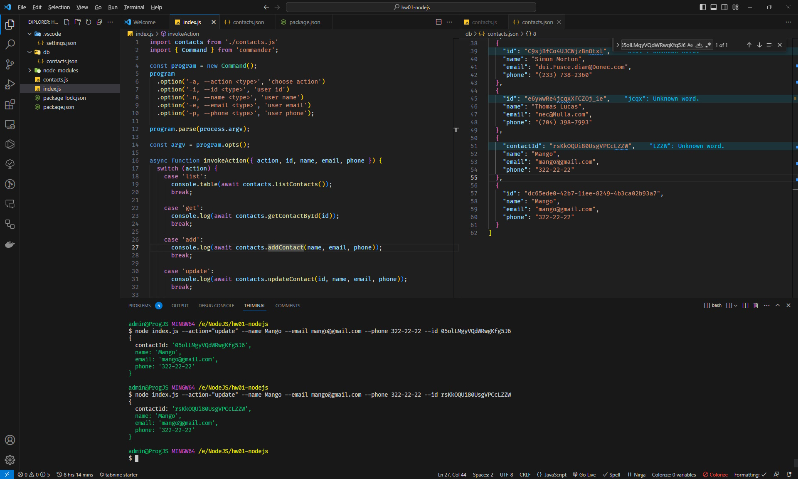

# goit-node-hw-01

# Отримуємо і виводимо весь список контактів у вигляді таблиці (console.table)

# Отримуємо контакт по id і виводимо у консоль об'єкт контакту або null, якщо контакту з таким id не існує.

# Додаємо контакт та виводимо в консоль об'єкт новоствореного контакту або null

# Оновлюємо контакт та виводимо в консоль об'єкт оновленого контакту або null

# Видаляємо контакт та виводимо в консоль об'єкт видаленого контакту або null, якщо контакту з таким id не існує.
